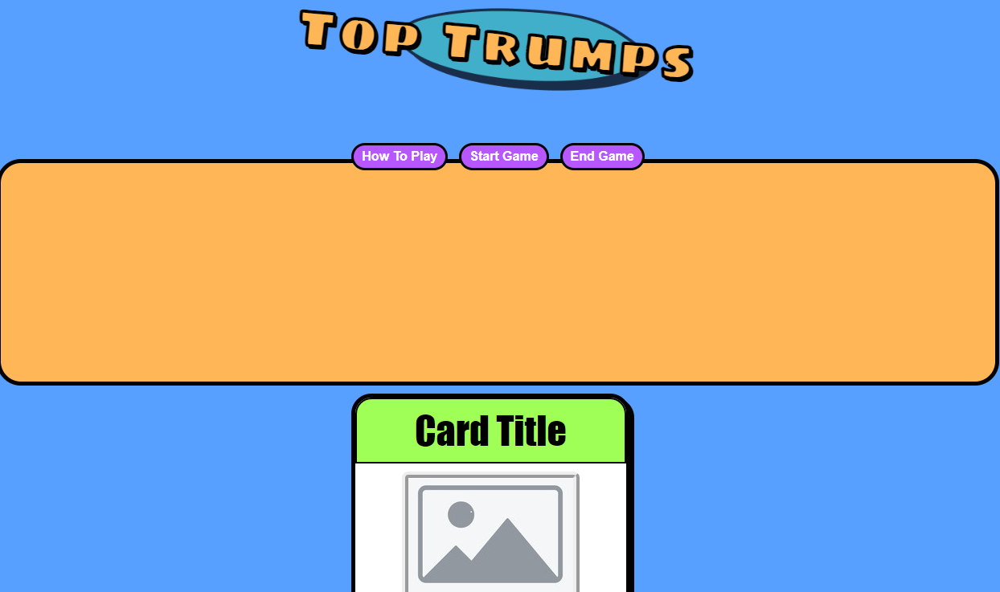
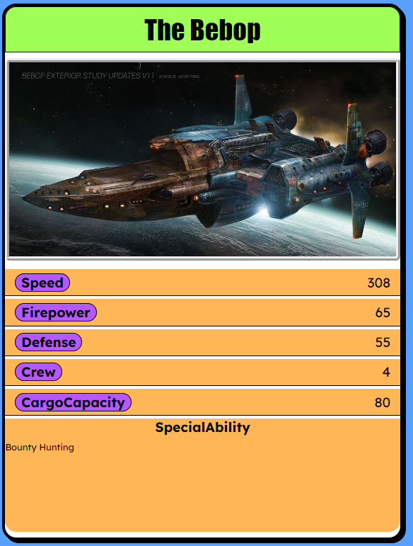
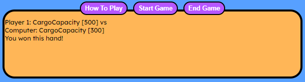

# TopTrumps App

## Basic concept of TopTrumps
Top Trumps is a card game where each player has a hand of cards featuring different subjects (like cars, animals, or superheroes). Each card has statistics in categories, such as speed, strength, or intelligence. Players take turns choosing a category and comparing the values on their cards. The player with the highest value in the chosen category wins the round and takes the other players' cards. The game continues until one player collects all the cards or has the most cards when the game ends.

This App will recreate this game digitally in a person vs computer card trading game. 

## Game Play
1. Player1 is shown their current card (selected from their deck automatically) on screen.
2. They can see the back of their opponant's (CPU) card. 
2. Player1 clicks to select which category, from their card, they are choosing for this hand.
3. CPU's card is revealed to Player1
4. A message is displayed declaring the winner of this hand.
> 1. If Player1 has won the hand this continues until Player1 loses a hand (due to having a lower score than the CPU in the chosen category)
> 2. If Player 1 has lost the hand, the CPU take over selecting the category each hand until they loose a hand.
5. On the CPUs turn, a message is displayed showing Player1 the category the CPU has selected and what it's value is. 
6. The winner of the hand will be declared and if the computer wins the player can click the next hand button to have the computer play it's next hand. But if the user wins the hand play passes back to them. 

### Ending The Game
1. Game play continues until either Player1 or CPU has no cards left
2. Play can be manually ended by clicking the End Game button.
> 1. If the game is ended manually, the player with the most cards will be declared as the winner.

### Future developement ideas
Depending on how long it takes to get a reliable MVP in place a number of alternatives could be added. 
1. An option to choose from a variety of TopTrump style decks on different topics. 
2. A greater level of design features such as smoother transitions or animations. 
3. A possible two human player option but not sure about this as would require users to be on seperate devices.
4. An option to have remaining cards in deck shown on screen or remain hidden 

## Screenshots

## Installation
This is a browser based game. No installation is required.

## Contributing
No contributions at this time.

## License
Created by Adam Gordon 2024. Creative commons?