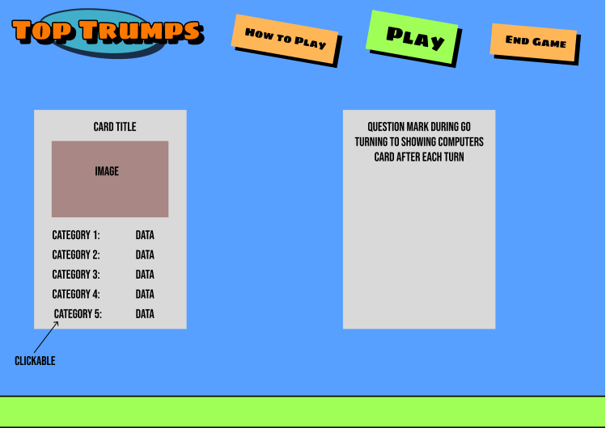

# Project Plan for TopTrumps App

## Basic concept of TopTrumps
Top Trumps is a card game where each player has a hand of cards featuring different subjects (like cars, animals, or superheroes). Each card has statistics in categories, such as speed, strength, or intelligence. Players take turns choosing a category and comparing the values on their cards. The player with the highest value in the chosen category wins the round and takes the other players' cards. The game continues until one player collects all the cards or has the most cards when the game ends.

## User story
### First Contact
1. As a user I want to understand where I have landed and what is on offer to me
2. As a user I might know what TopTrumps is but I might not.
> 1. If I know TopTrumps I will want to get on and play. 
> 2. If I don't know TopTrumps I will want to be able to view a simple overview that explains the gameplay/rule
3. As a user I might have accessabiliy needs. I expect the site to be accessable irrespective of my needs. 
4. As a user I want to be interested and drawn in to find out more

### Game Play
1. As a user I want the user interface to be intuative
2. Although the user interface should be intuative I may need some explicit prompts to ensure accessability
3. As a user I will enjoy the game more if it is styled well and is visually appealing
4. It should be clear to me when it is my turn
5. It should be clear to me how to take my turn
6. After each hand I should get to see my oponants hand and this should stay on screen until I make a selection to move on. 
7. When I am chosing the cetegory I should have as long as I like to make my choice.
8. When it is my oppenants (CPUs) turn there should be a some small delays to make the game feel more natural.
9. A hand might play something along the lines of:
> 1. I am shown my card.
> 2. I click to select which category I am choosing for my turn.
> 3. My opponant's card is revealed to me
> 4. I am told if I have won the hand or lost the hand
> 5. If I have won the hand this continues until I lose a hand (due to having a lower score in my chosen category)
> 6. If I have lost the hand my opponant begins choosing categories. I am shown a message telling me the category they have chosen and what their score is. (Either automatically after a pause or upon my click) My opponant's card is revealed and a message shown as to the winner of that hand. 

### Ending The Game
> 1. Game play continues until one player has no cards left
> 2. As a user I might not have time to finish an entire game so I would like an option to end the game and at the point the player with the most cards (objects in their playersDeck Array) will be declared as the winner.
> 3. Whether I win or lose I would like a pleasant message or animation to leave me feeling positive about the experience. 

### Even Better If
Depending on how long it takes to get a reliable MVP in place a number of alternatives could be added. 
1. An option to choose from a variety of TopTrump style decks on different topics. 
2. A greater level of design features such as smoother transitions or animations. 
3. A possible two human player option but not sure about this as would require users to be on seperate devices. 

## Technologies/dependancies
* __structre__ - HTML
* __Styling__ - CSS
* __Programming__ - JavaScript
* __Version control__ and deployment - GitHub
* __Documentation__ - Markdown
* __AI__ - ChatGPT (Data set generation)

## Pseudocode
### Constants
* const deckName = [{}]
* const p1Deck = []
* const cpuDeck = []

### Variables (state)
* let p1Card = {} 
!!!!!Note!!!! Need to work out or find out if the p1 and cp cards should be const or let. The content of that card will change each hand but the card itself wont. Plus is it ok to be a let if it's an object rather than a list?
* let cpuCard = {}
* let turn
* let winner
* let cardsLeftP1
* let cardsLeftPU
* let drawContainer

### Cached Element References
const p1DispCard (html element where data from letP1card will be displayed on page)
const cpuDispCard (same as above)
const gameMessages
const startGameBtn
const category selector 
> what's the target (buttons)buttons multiple? ( first itteration simple but far more
complex with additional decks is the text for sections created by the card object from the outset?)

### Functions
const shuffle = () =>{
    randomly rearange objects in the deckName array
}
const deal = () =>{
    evenly distribute the contents of deckName in to p1Deck and cpuDeck
}

const switchPlayerTurn = () => {
    if player win turn = player
    if cpu win turn = cpu
}

const endGame = () => {
    if the endGame button is pressed
    force the end of the game
    find if playerDeck or cpuDeck has more objects and declar the winner
    if same number of cards it's a draw
}
const checkGameWin = () => {
    if either playerDeck or cpuDeck have no objects left
    end the game and send a message declaring the winner 
}
(__might be another function but__(to include moving a card from one players deck 
to the other))

const checkHandWin = () => {
    get the category from either player click or cpu random select
    for the selected category check the value in playerCard again value in same index in cpuCard. 
    highest value wins
    both current Cards are Added into the winners deck
    IF the handWinner is the same as turn deal newHand
    if the handWinner is different to turn change turn to the new player
    if the value is the same run draw()
}
const newHand = () => {
    take the object at index [0] in each players deck and 
    display all data in the correct position on the card area of the webpage
}
const draw = () => {
    store both of the origional cards in drawContainer
    whoever is next to win a hand, get all the cards from the container added to their deck
    if it's another draw more those cards are also added to the container until a handWinner is declared
}

const updateMessage = () => {
    function called to display messages called in other functions on the message area of the screen
}
const render = () => {
    update message on the board
    !!!!This might be the best place to include the dating of card areas with data from the currentCards
}
const handleCatSelect = () => {
    check which category was select via event.listener
    then call the 
    checkHandWin()
    draw()
    endGame()
    checkGameWin()
    switchPlayerTurn()
}
const init

### Event Listeners
startGameBtn

catSelectBtn1
catSelectBtn2
catSelectBtn3
catSelectBtn4
catSelectBtn5
catSelectBtn6
catSelectBtn7

endGameBtn

Multipledecks would require a drop down but also whole bunch of extra functions so won't worry about that for now. 

# Wireframe

